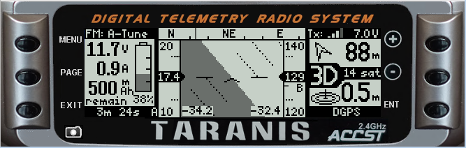
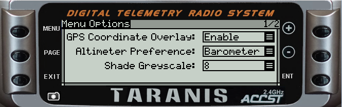
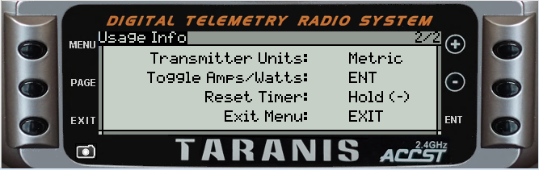

# openlua
OpenTX LUA telemetry script for use with Ardupilot - OpenTX 2.2 - Taranis X9d+

Copy the IMAGES/ , SCRIPTS/ , and SOUNDS/ folders to SD card.

Started working on this in January 2018 after discovering the Craft and Theory cables and FlightDeck.  Decided to write my own lua script.
Since then, been adding features and testing - still a work in progress.

Have flown my test plane (FT Sea Duck) out of site and navigated back safely using GUI only!

Enjoy!
-Snowfan
